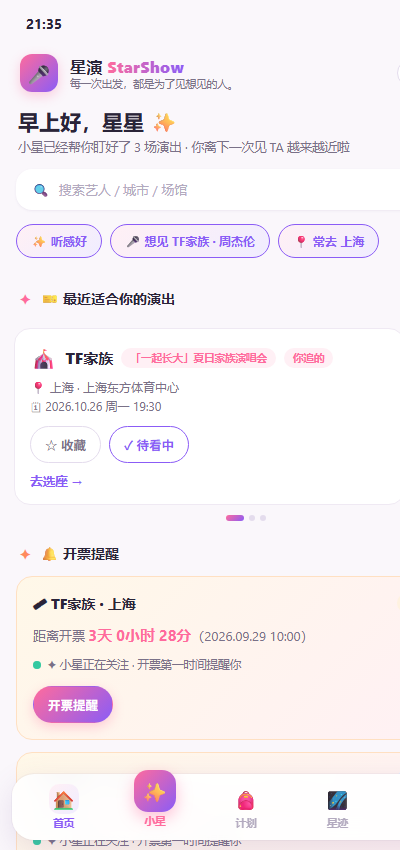
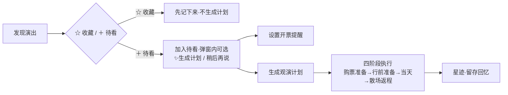
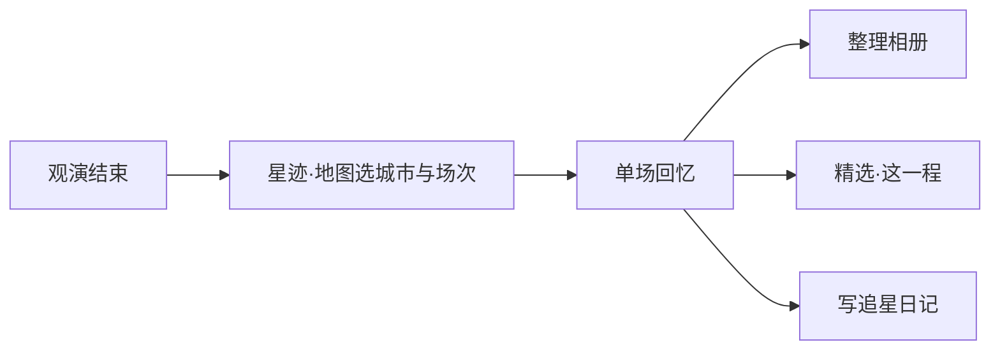
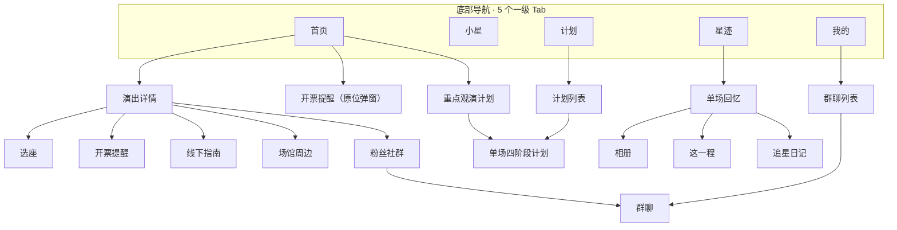
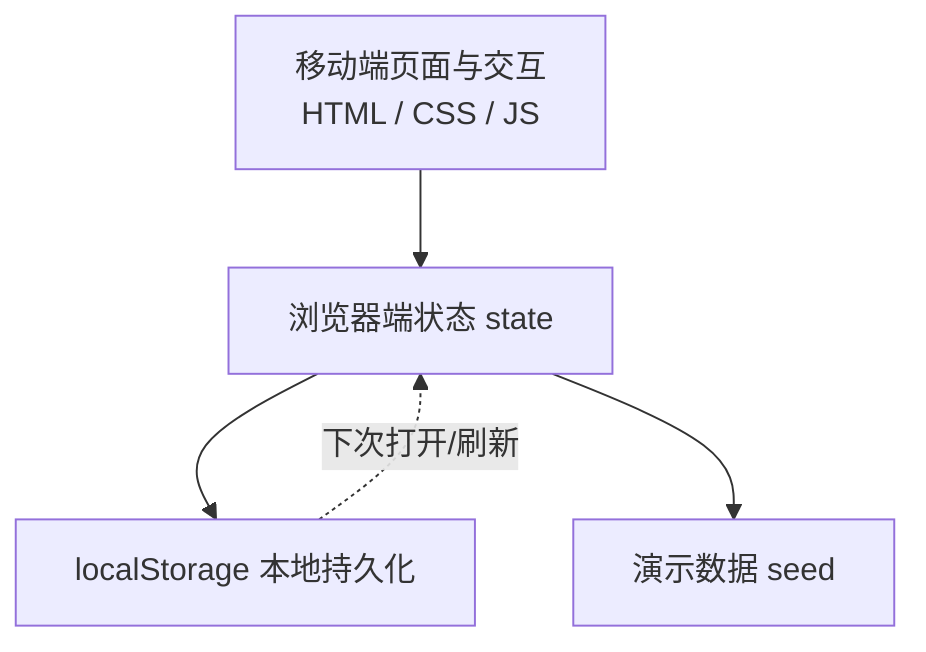
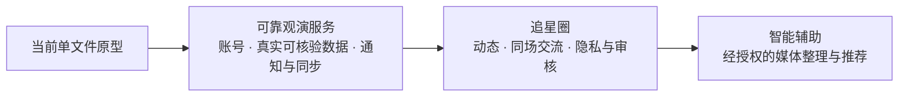

# 星演 StarShow · 移动端观演陪伴产品

> **每一次出发，都是为了见想见的人。**

**星演（StarShow）** 是一款面向演唱会观众的**移动端观演陪伴产品（Concert Companion）**：把「发现演出 → 关注开票 → 制定计划 → 线下观演 → 留存回忆」串成一条完整旅程。大麦给你「信息」，星演给你「决策」和「陪伴」——不止帮你选对座位，还帮你生成并管好一整套观演计划，陪你走完从「官宣」到「现场」，再到「把这一天留下」的全程。

---

> ⚠️ **原型说明（重要）**：本仓库当前是一个**可交互的移动端产品原型（高保真 Demo）**，纯前端实现。演出信息、开票时间、AI 对话、群聊、地图、照片视频均为**本地演示数据或模拟交互**；小星为**脚本化助手**（非真实 AI），群聊为**模拟消息**（非实时聊天），开票提醒为**页面内开关**（非系统推送），未接入真实票务 / 官方开票监测，也不存在后端服务。刷新后数据保存在**浏览器本地**，不会上传。

## 目录

1. [项目概览](#一项目概览)
2. [问题与需求分析](#二问题与需求分析)
3. [产品设计与信息架构](#三产品设计与信息架构)
4. [关键用户流程](#四关键用户流程)
5. [原型实现与运行](#五原型实现与运行)
6. [需求优先级与未来路线图](#六需求优先级与未来路线图)
7. [产品边界与下一步](#七产品边界与下一步)

---

## 一、项目概览

### 1.1 一句话定位

面向演唱会观众的一站式移动端「观演陪伴」产品：从发现想看的演出，到抢票、安排行程、现场观演，再到把这场回忆整理留下来。

### 1.2 完整体验闭环

- **发现**：基于「想见谁 / 城市 / 预算 / 在意什么」的可编辑追星档案，推荐适合的演出。
- **关注开票**：收藏感兴趣、加入待看；对重点演出设置开票提醒与倒计时。
- **制定计划**：一键生成四阶段观演计划（购票准备 / 行前准备 / 演出当天 / 散场返程）。
- **线下观演**：可解释选座 + 住宿 / 交通 / 天气 / 清单 + 演出当天 D-Day 路线。
- **留存回忆**：演出结束后用「星迹」把座位、路线、瞬间沉淀成地图、相册与日记。

### 1.3 预览与运行

- **在线预览**：<https://zz10965-alt.github.io/starshows-mobile/>
- **本地运行**：仓库为单文件，直接用浏览器打开 `index.html` 即可（无需构建、无需安装依赖）。
- **重置 Demo**：「我的 → 重置演示数据」恢复默认演示内容。

### 1.4 三步体验（约 1 分钟）

1. 🏠 **首页** → 看「最近适合你的演出」，点开一张演出卡。
2. 💺 **选座** → 切换偏好（离爱豆近 / 听感好 / 性价比）看推荐变化；或 🎟 **开票** → 设提醒、加日历。
3. ✨ **小星** → 输入「换个便宜一点的酒店」看它直接改计划；或 🌌 **星迹** → 看被留下的现场。

---

## 二、问题与需求分析

> 本节为**产品设计假设与场景分析**，来自对观演行为的观察与推演，**尚未经过系统用户访谈或量化验证**，不构成已验证的研究结论。

### 2.1 目标用户与典型场景

- **同时关注多场演出的粉丝**：想比价、比档位、记住每场开票时间，避免错过抢票。
- **想整理每场观演经历的人**：看完后希望把座位、路线、照片、感受有序留存，而不是散落在相册和聊天记录里。
- **期待在追星与现实社交之间保持边界的用户（待验证假设）**：希望自主切换「圈内 / 现实」并选择性分享。对应能力（独立昵称、可见性分级、私信）为**待开发**，当前原型尚未实现。

### 2.2 痛点—场景—方案—现状

| 用户痛点 | 具体场景 | 产品方案 | 当前实现状态 |
| --- | --- | --- | --- |
| 静态座位图只告诉你「位置在哪」，不告诉你「体验如何」 | 抢票前纠结选哪个档位 | 对场馆各档位做「视野 / 音响 / 距离 / 价格」多维打分并输出可解释推荐 | ✅ 已演示 |
| 信息分散、容易错过开票 | 多场演出开票时间不同、记不住 | 开票时间管理 + 倒计时 + 提醒开关 + 日历 .ics | ✅ 已演示（无真实推送） |
| 攻略散落各平台、行程没人管 | 出发前要自己拼酒店 / 交通 / 天气 / 清单 | AI 观演计划四阶段 + 演出当天 D-Day 路线 | ✅ 已演示 |
| 计划不会随变化自动更新 | 抢到不同票档 / 改主意 / 天气变了 | 聊天直接改计划，Agent 主动重排 | ✅ 已演示（脚本化） |
| 看完后记忆无处安放 | 票根躺在相册里、回忆靠脑补 | 「星迹」演出后记忆系统（地图 / 时间线 / 相册 / 日记） | ✅ 已演示 |

### 2.3 产品目标与指标（仅定义，不填结果）

以下为**建议关注的可观察指标**，用于验证产品是否「有用」，本仓库未填写任何虚构数值：

- **发现→待看转化**：浏览推荐后加入「待看」的比例（衡量推荐是否切中需求）。
- **开票提醒完成率**：加入待看后完成「开票时间 + 提醒开关」设置的比例（衡量抢票场景价值）。
- **计划创建率**：加入待看后生成观演计划的比例（衡量规划诉求强弱）。
- **相册 / 日记使用率**：观演后创建相册或写日记的比例（衡量记忆留存诉求）。

---

## 三、产品设计与信息架构

### 3.1 各页面承担的任务

| 页面 | 承担的任务 |
| --- | --- |
| 🏠 首页 | 「发现与总览」：问候 + 搜索 + 偏好 Chip + 适合你的演出推荐（横滑）+ 开票提醒 + 单个重点观演计划 |
| ✨ 小星 | 「对话式助手」：找演出 / 选座 / 查酒店 / 看安检 / 盯开票 / 改计划 |
| 🎒 计划 | 「执行与管理」：观演计划列表 → 单场四阶段计划（购票准备 / 行前准备 / 演出当天 / 散场返程） |
| 🌌 星迹 | 「演出后记忆」：地图 / 时间线、单场回忆、我的相册、追星日记 |
| 👤 我的 | 「设置与归档」：档案 / 待看列表 / 收藏列表 / 观演计划 / 群聊 / 星迹 / 重置 |

### 3.2 收藏 / 待看 / 观演计划 三者的区别

这是理解本产品的关键，**三者不等同**：

- **收藏（Favorites）**：对某场演出「感兴趣，先记下来」，不产生任何计划。
- **待看（Watchlist）**：确定「想看 / 要抢」，是设置开票提醒、进入规划的**触发器**。
- **观演计划（Plan）**：针对**某一场**演出的具体行程安排（抢票策略 + 住宿 + 交通 + 天气 + 清单 + 当天路线）。

同一场演出可同时「收藏 + 待看」；「加入待看」不等同于「已有计划」，只有主动「生成计划」才会创建观演计划。

### 3.3 多场计划的管理与置顶

- 多场计划以**列表**统一管理（「计划」Tab 与「我的 → 观演计划」进入同一份列表）。
- 支持将**最多 1 个**重点计划**置顶到首页**，便于一眼看到最近要追的那一场。

### 3.4 星迹的层级与三种记录方式

星迹按「**地图城市节点 → 该城市的演出场次 → 单场回忆**」逐层下钻。单场回忆内部区分三种用途不同的记录：

- **相册（Albums）**：用于**保存媒体**（照片 / 视频），支持新建、命名、设封面、备注，按时间九宫格浏览。
- **这一程（Journey）**：用于**精选关键时间节点**（出发 / 到场馆 / 开场 / 散场等），快速回看当天脉络。
- **追星日记（Diaries）**：用于**记录整天的感受**（标题 + 正文），按日期倒序，可选关联某本相册。

三种方式用途不同、彼此独立，也可在同一场回忆里互相引用（如「这一程」节点关联相册里的某张照片）。

### 3.5 群聊的入口层级

演出详情「社群」→ 加入场次群 / 进入群聊；「我的」→「我的群聊」→ **群聊列表**（按场次） → **单个群聊界面**（按频道筛选消息）。

### 3.6 核心模块—价值—交互—状态

| 核心模块 | 用户价值 | 关键交互 | 当前状态 |
| --- | --- | --- | --- |
| 可解释选座 | 看懂「为什么推荐这个座位」 | 切换偏好（离爱豆近 / 听感好 / 性价比），推荐实时变化 + 剖面视角预览 | ✅ 已演示 |
| 开票时间管理 | 不错过抢票 | 三态展示、倒计时、提醒开关、日历 .ics | ✅ 已演示（无推送） |
| AI 观演计划 | 行程有人管 | 四阶段 Timeline、标记完成、住宿 / 交通选择 | ✅ 已演示 |
| 聊天改计划 | 变化时主动重排 | 「换酒店 / 当天往返 / 加火锅」等指令直接改计划 | ✅ 已演示（脚本化） |
| 粉丝社群 | 找到同场的人 | 加入场次群、频道筛选、有用信息关联到计划 | ✅ 已演示（mock） |
| 星迹 | 把这一天留下 | 地图 / 时间线 / 单场回忆 / 相册 / 日记 | ✅ 已演示 |

---

## 四、关键用户流程

### 4.1 主流程：从发现到观演

> 说明：「＋ 待看」**不会自动创建计划**——加入待看后弹窗会明确问「✨ 生成 AI 观演计划 / 稍后再说」；开票提醒与生成计划也是两个独立动作。「收藏」只是兴趣标记。四阶段计划是单场演出的行程，与「待看」是两个层级。

### 4.2 观演后：整理回忆

> 说明：回忆以「城市 → 场次 → 单场」为层级；单场回忆内，相册 / 这一程 / 日记是三种并列的记录方式。

### 4.3 信息架构（主要页面关系）

---

## 五、原型实现与运行

### 5.1 技术栈（如实）

| 技术 | 作用 |
| --- | --- |
| HTML5 | 单文件页面结构（移动端 viewport 内多子页） |
| CSS3 | 移动端优先的自定义设计系统（CSS 变量 / flexbox / 内联 SVG 地图占位） |
| JavaScript（ES6，原生） | 全部交互与渲染逻辑，无框架、无构建步骤 |
| localStorage | 浏览器本地持久化（键 `starshows_v2`），仅本机可见 |
| 内联 SVG / Leaflet（CDN，可选） | 场馆 / 酒店周边模拟地图；Leaflet 加载失败自动回退 SVG |

### 5.2 技术结构（现状，无后端）

> 本图只描述现状：**没有服务器、没有数据库、没有账号系统**。所有「数据」都在浏览器内存 / localStorage 中，AI、群聊、提醒、演出信息均为前端模拟。

### 5.3 如何体验

1. 浏览器打开 `index.html`（或访问在线预览地址），首次进入弹出「怎么体验」引导。
2. 🏠 首页：看推荐演出 → 点演出卡进详情（选座 / 线下指南 / 周边 / 社群）。
3. 💺 选座：切换偏好看推荐变化 + 剖面视角预览。
4. 🎟 开票：看三态 + 倒计时 + 提醒开关 + 生成 .ics。
5. 🎒 计划：四阶段独立可点；行前准备选住宿 / 交通；演出当天看 D-Day 路线。
6. ✨ 小星：输入「帮我换个便宜一点的酒店」「什么时候开票」「帮我选个座」看 Agent 响应。
7. 🌌 星迹：地图 / 时间线 → 单场回忆 → 相册 / 这一程 / 日记。
8. 👤 我的：编辑档案、查看列表、重置 Demo。

### 5.4 演示数据的相对日期逻辑

- 演示日期为**相对日期**：例如开票 = 「今天 + 3 天」、演出 = 「今天 + 30 天」，不写死年月日。
- 在**打开或刷新页面时**按当天重算；同一天多次刷新结果一致，跨天后下次打开自动顺延。
- 统一以**中国时区（UTC+8）**为基准，任意地区打开显示一致。
- 用户**手动编辑**的开票时间会被保留，不再随演示日期顺延；自动生成的开票时间标注为「**演示时间**」（而非「官方信息」）。

---

## 六、需求优先级与未来路线图

| 阶段 | 用户问题 | 计划能力 | 实现前提 | 验证方式 |
| --- | --- | --- | --- | --- |
| **近期 · 可靠观演服务** | 演出与开票信息不可信、日期时区易错、提醒不落地、数据只在本机 | 真实可核验的演出 / 开票数据源；时区与日期规范化；真实通知能力；跨设备同步；媒体保存与备份 | 待接入：真实票务 / 演出信息数据源、通知推送、账号体系与跨设备同步、媒体存储 | 用真实演出数据验证「发现→待看→提醒」链路；跨设备数据一致性测试 |
| **中期 · 追星圈**（以具体演出为单位小范围验证） | 想和同场的人交流，但不想把追星身份混入现实社交 | 按艺人 / 城市 / 场次建圈；发布动态、评论、收藏；同场交流场馆与出行经验 | 待开发：账号与内容服务、内容审核、独立昵称与可见性分级（仅自己 / 圈内 / 公开） | 圈内留存与互动率；可见性设置的使用率 |
| **后期 · 智能辅助**（逐步扩展私信与智能回忆整理） | 回忆整理费时、想让 AI 帮着分类但不失控 | 经同意的私信、同场结伴与共同回忆；照片视频按时间 / 地点 / 人物的可选辅助分类；生成可编辑的观演回顾 | 待评估：经用户授权的人物识别与位置使用、可纠错的 AI 能力（技术选型按数据来源与效果评估确定） | 分类准确率与用户纠错成本；回顾的采纳率 |

> **社区能力需同步规划**：举报、拉黑、私信权限、内容管理与防诈骗机制，应随「追星圈」一期一并设计，不能放到「以后再说」。

### 6.1 未来技术演进路线

> 本图仅表示**推进顺序**，不把「未来可能用到的技术组件」当成已确定的系统设计；具体技术前提见本节上方的阶段表。

---

## 七、产品边界与下一步

### 7.1 当前已演示 / 尚未接入 / 未来设想

| 能力 | 当前已演示 | 尚未接入 | 未来设想 |
| --- | --- | --- | --- |
| 选座推荐 | ✅ 多维打分 + 可解释推荐 | 真实场馆座位图与历史测评 | 社区 UGC 座位实测 |
| 开票提醒 | ✅ 倒计时 + 页面内提醒开关 + .ics | 真实开票监测与系统推送 | 开票节点系统推送 |
| 观演计划 | ✅ 四阶段 + 改计划 | 真实地图 / 天气 / 交通 API | 与票务平台打通「决策→下单」 |
| 社群 | ✅ 模拟群聊 + 频道筛选 | 真实多用户聊天 | 追星圈（独立昵称 / 可见性分级，待开发） |
| 星迹 | ✅ 相册 / 这一程 / 日记 | 云存储与备份 | AI 辅助整理与观演回顾 |
| AI | ✅ 脚本化对话（规则匹配） | 真实 AI 尚未接入，技术方案待按数据来源与效果评估确定 | 个性化推荐与主动重排 |

### 7.2 最值得优先验证的假设

1. **「待看 → 生成计划」是真实刚需**：验证方式是让目标用户完成「管理两场演出」（加入待看、设开票提醒、生成并调整计划），观察是否有意愿走到「生成计划」。
2. **「观演后愿意整理回忆」**：验证方式是让用户完成「整理一场演出的回忆」（建相册、选这一程、写日记），观察完成率与主观意愿。
3. **「可解释选座」比「静态座位图」更有价值**：验证方式是同一场演出分别用两种方式选座，比较决策信心与采纳意愿。

### 7.3 后续迭代顺序及理由

1. **先做「可靠观演服务」**（真实数据源 / 通知 / 同步 / 备份）：这是个人观演管理成立的地基，也最容易暴露「是不是伪需求」。
2. **再做「追星圈」**：以**具体演出为单位小范围验证**（同一场次的人先聚起来）；社交依赖同场用户与内容审核，但**防诈骗 / 举报 / 独立昵称与可见性机制**需随其一并设计，不能缺席。
3. **之后逐步扩展「私信与智能回忆整理」**：在验证追星圈的基础上，再扩展经授权的私信，以及 AI 辅助的媒体整理与观演回顾（技术选型待按数据与效果评估确定）。

> 以上为方向性规划，**不承诺具体上线日期**。

